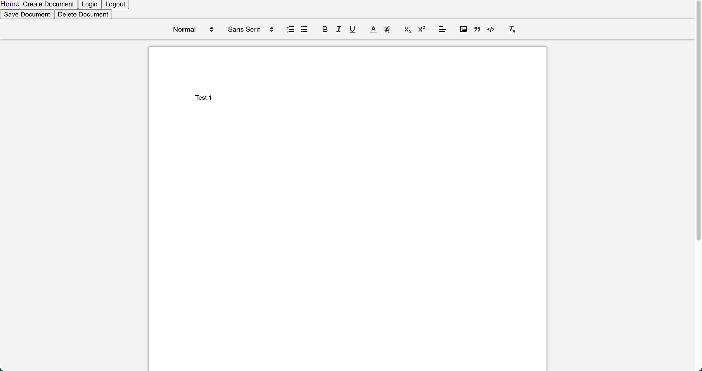
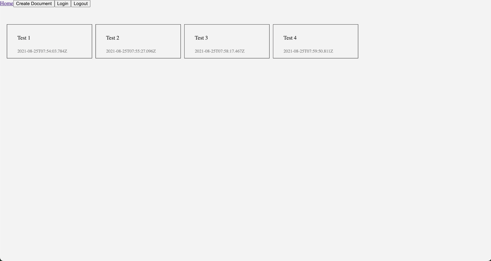
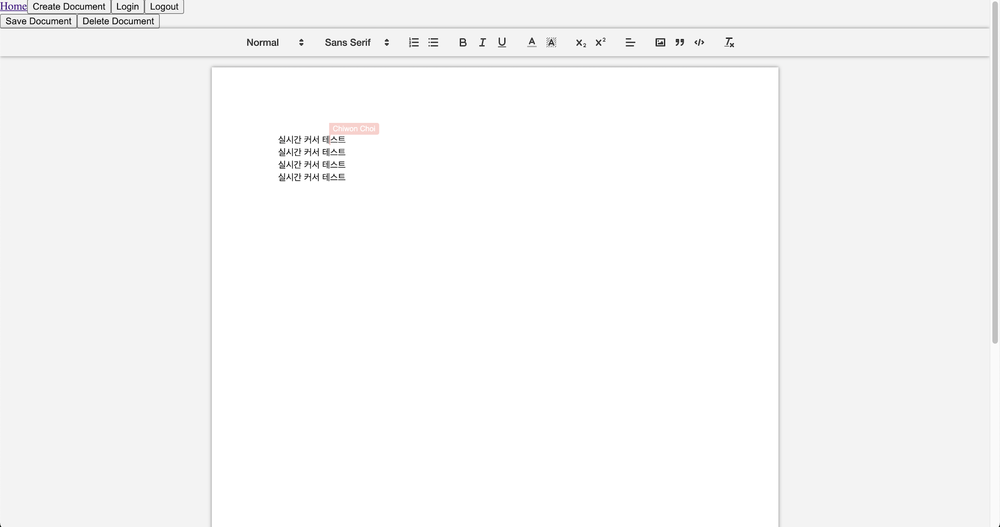

<h1 align="center">
  Google Dogs
</h1>

<p align="center">
  
</p>

<p align="center">
  
  
  
  
  <a href="https://app.netlify.com/sites/elegant-boyd-64c1c7/deploys" title="Netlify-deploy-status">
    
  </a>
</p>

**MERN Stack**과 socket.io를 이용한 문서작업용 실시간 협업 툴 web application

<!-- TABLE OF CONTENTS -->
<details open="open">
  <summary>Table of Contents</summary>
  <ol>
    <li><a href="#installation">Installation</a></li>
    <li><a href="#usage">Usage</a></li>
    <li><a href="#ui example">UI example</a></li>
    <li><a href="#function">Function</a></li>
    <li><a href="#demo">Demo</a></li>
  </ol>
</details>

## Installation

```sh
Server

cd Backend
npm install

Client

cd FrontEnd
npm install
```

## Usage

```sh
Server

cd Backend
npm run dev

Client

cd FrontEnd
npm start
// localhost:3000
```

## UI example

#### 문서 작성 예시 UI



#### 문서 목록 예시 UI



#### 동시접속 실시간 커서 예시 UI



## Function
 - 구글을 이용한 소셜 로그인
 - 로그인한 유저가 생성한 문서 목록 확인 가능
 - 문서 URL을 공유하여 다른 사람들과 동시 작업 가능
 - 수동 저장 또는 20초에 한번 자동 저장

## Demo

https://elegant-boyd-64c1c7.netlify.app/

(Client - netlify, Server - heroku)
